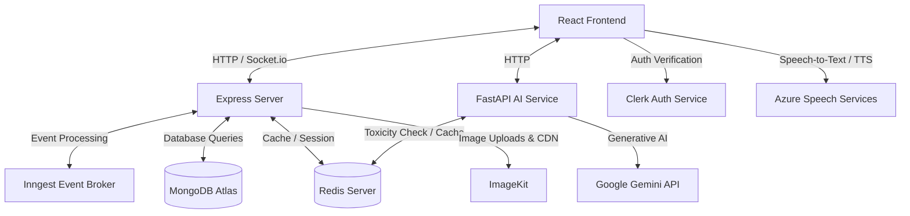

# PingUp 🚀

PingUp is a state-of-the-art, feature-rich social media application built with a modern decoupled architecture. It provides users with real-time communications, rich feeds and stories, interactive connections, and a suite of advanced AI integrations (powered by Google Gemini and TensorFlow) designed to enhance user engagement.

---

## 📋 Table of Contents

1. [Features](#-features)
2. [Architecture](#-architecture)
3. [Tech Stack](#-tech-stack)
4. [Project Directory Structure](#-project-directory-structure)
5. [Environment Configuration](#-environment-configuration)
6. [Getting Started & Installation](#-getting-started--installation)
7. [API & Services Overview](#-api--services-overview)
8. [Deployment](#-deployment)

---

## ✨ Features

- **👥 Feed & Social Connections**: Users can create posts with media, comment on posts, manage connection requests, follow friends, and view stories.
- **💬 Real-Time Messaging**: Real-time direct chat and messaging supported by Socket.io, featuring read/unread statuses, typing indicators, and message deletions.
- **📞 Voice Calling**: Seamless voice and video calling features built using WebRTC and real-time signaling.
- **🤖 PingBuddy AI Chat Assistant**: An intelligent in-app companion powered by Google Gemini `gemini-2.5-flash` that helps users draft replies, answers questions, and coordinates interactions.
- **🪄 Photo Magic**: An AI-powered media analyzer. Upload an image, and PingBuddy will generate catchy captions, trending hashtags, or inspiring quotes.
- **🧠 Slang & Cultural Decoder**: Understand the context of any post or comment. PingUp AI explains slang, idioms, memes, or cultural jargon concisely.
- **🛡️ Toxicity Checker**: A machine learning service built into the AI backend using TensorFlow to verify comments/posts and flag toxic or offensive content before it is published.
- **⚡ Background Job Processing**: Uses Inngest to orchestrate background queues (such as user synchronization from Clerk Webhooks, email notifications, and data updates).

---

## 🏗️ Architecture

PingUp utilizes a decoupled multi-service architecture:



---

## 💻 Tech Stack

### Frontend (`/client`)
- **Framework**: React 19, Vite
- **State Management**: Redux Toolkit & React-Redux
- **Styling**: Tailwind CSS v4, Lucide React (Icons)
- **Real-Time**: Socket.io Client
- **Authentication**: Clerk React SDK
- **Utilities**: Axios, React Hot Toast, Moment.js, React Speech Recognition

### Primary Backend (`/server`)
- **Runtime**: Node.js (Express v5)
- **Database**: MongoDB (via Mongoose ORM)
- **Real-Time**: Socket.io Server (with Redis Adapter)
- **Event Orchestration**: Inngest SDK
- **File Uploads**: ImageKit SDK (Media Hosting)
- **Email Notifications**: Nodemailer / Resend
- **Auth Middleware**: Clerk Express Middleware

### AI Service Backend (`/ai_backend`)
- **Framework**: FastAPI (Python 3)
- **SDK**: Google GenAI SDK (Gemini `gemini-2.5-flash` model integration)
- **Caching & Rate Limiting**: Redis Async client (with Lua scripts)
- **Machine Learning**: TensorFlow (local toxicity model classification)

---

## 📂 Project Directory Structure

```text
pingup/
├── client/              # React Frontend (Vite, Redux, Tailwind v4)
│   ├── src/
│   │   ├── Pages/       # Feed, Profile, Messages, calling rooms, AI features
│   │   ├── components/  # Modals, sidebars, cards, notifications
│   │   ├── api/         # Axios configurations & WebSocket clients
│   │   └── features/    # Redux slices (user, connections, messages)
│   └── package.json
│
├── server/              # Express Node Backend (Socket.io, MongoDB, Inngest)
│   ├── configs/         # Database, Nodemailer, ImageKit, Redis configurations
│   ├── controllers/     # Controller logic for users, posts, stories, messages
│   ├── models/          # Mongoose Schemas (User, Post, Story, Messages, etc.)
│   ├── routes/          # Express API route endpoints
│   ├── inngest/         # Inngest background event handlers & Clerk sync
│   ├── socketManager.js # WebSocket event listeners for chats and WebRTC calls
│   └── package.json
│
└── ai_backend/          # Python AI Backend (FastAPI, Google GenAI SDK)
    ├── main.py          # FastAPI application endpoints & Redis rate-limiting
    ├── services/        # ML helpers (Toxicity classifier)
    └── requirements.txt # Python package requirements
```

---

## ⚙️ Environment Configuration

To run the application, copy or create `.env` files in each service directory.

### 1. Frontend Configuration (`client/.env`)
Create `client/.env`:
```env
VITE_BASEURL=http://localhost:4000
VITE_CLERK_PUBLISHABLE_KEY=your_clerk_publishable_key
VITE_AI_API_URL=http://localhost:8000
VITE_AZURE_SPEECH_KEY=your_azure_speech_key
VITE_AZURE_REGION=your_azure_speech_region
```

### 2. Primary Node Backend Configuration (`server/.env`)
Create `server/.env`:
```env
PORT=4000
MONGODB_URL=mongodb+srv://...
CLERK_SECRET_KEY=your_clerk_secret_key
CLERK_PUBLISHABLE_KEY=your_clerk_publishable_key
FRONTEND_URL=http://localhost:5173
REDIS_URL=redis://localhost:6379

# ImageKit Integration
IMAGEKIT_PUBLIC_KEY=your_imagekit_public_key
IMAGEKIT_PRIVATE_KEY=your_imagekit_private_key
IMAGEKIT_URL_ENDPOINT=your_imagekit_url_endpoint

# Email Notifications
STMP_USER=your_smtp_username
STMP_PASS=your_smtp_password
SENDER_EMAIL=noreply@yourdomain.com
```

### 3. AI Service Backend Configuration (`ai_backend/.env`)
Create `ai_backend/.env`:
```env
GEMINI_API_KEY=your_gemini_api_key
REDIS_URL=redis://localhost:6379
```

---

## 🚀 Getting Started & Installation

Ensure you have [Node.js](https://nodejs.org/) (v22+ recommended), [Python 3](https://www.python.org/), and [Redis](https://redis.io/) installed and running on your local machine.

### Step 1: Run Redis Server
Start your local Redis server:
```bash
# On Linux/macOS
redis-server

# On Windows (WSL or native executable)
redis-server.exe
```

### Step 2: Set Up the AI Backend (`/ai_backend`)
1. Navigate to the AI directory:
   ```bash
   cd ai_backend
   ```
2. Create and activate a python virtual environment:
   ```bash
   python -m venv venv
   # On Windows:
   venv\Scripts\activate
   # On macOS/Linux:
   source venv/bin/activate
   ```
3. Install dependencies:
   ```bash
   pip install -r requirements.txt
   ```
4. Start the FastAPI server:
   ```bash
   uvicorn main:app --reload --host 0.0.0.0 --port 8000
   ```

### Step 3: Set Up the Primary Node Backend (`/server`)
1. Navigate to the server directory:
   ```bash
   cd ../server
   ```
2. Install npm dependencies:
   ```bash
   npm install
   ```
3. Start the Express server:
   ```bash
   # Development mode with Nodemon
   npm run dev
   # Or directly
   npm start
   ```
4. *(Optional)* Run Inngest Dev Server to test background jobs:
   ```bash
   npx inngest-cli@latest dev -u http://localhost:4000/api/inngest
   ```

### Step 4: Set Up the Frontend (`/client`)
1. Navigate to the client directory:
   ```bash
   cd ../client
   ```
2. Install npm dependencies:
   ```bash
   npm install
   ```
3. Run the Vite development server:
   ```bash
   npm run dev
   ```
4. Open your browser and navigate to `http://localhost:5173`.

---

## 🔗 API & Services Overview

### Core Backend Endpoints (`http://localhost:4000/api`)
- `/user`: Handles profile fetching, connections, follower listings, and status sync.
- `/post`: Creates, reads, likes, and comments on user posts.
- `/story`: Posts and fetches ephemeral user stories.
- `/message`: Retrieves chat history and message rooms.
- `/inngest`: Serving endpoint for background jobs.

### AI Backend Endpoints (`http://localhost:8000/api`)
- `/api/chat`: PingBuddy assistant chat using Gemini with Redis-based sliding window rate-limiting.
- `/api/photo-magic`: Multimodal generation endpoint that creates quotes/captions/hashtags for uploaded images.
- `/api/explain`: Post analyzer that decodes internet slang, cultural jokes, or idioms.
- `/api/check-toxicity`: Machine learning comment evaluator powered by TensorFlow.

---

## 📦 Deployment

This project is configured to deploy seamlessly to cloud hosting platforms:
- **Frontend / Node Server**: Preconfigured with `vercel.json` for hosting on [Vercel](https://vercel.com).
- **FastAPI Backend**: Can be containerized via Docker or hosted directly on [Render](https://render.com) / [Railway](https://railway.app).
- **Database**: Recommended to use [MongoDB Atlas](https://www.mongodb.com/products/platform/atlas-database) (cloud) and [Upstash Redis](https://upstash.com) (serverless Redis).
