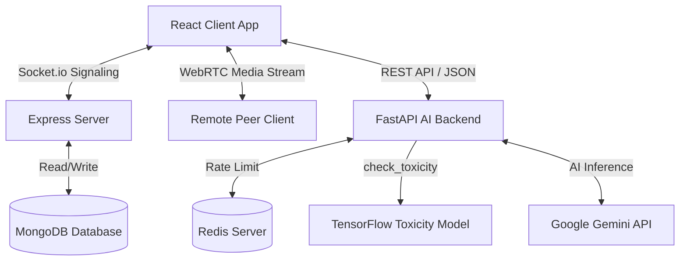

# PingUp 🚀

[](https://react.dev/)
[](https://nodejs.org/)
[](https://expressjs.com/)
[](https://fastapi.tiangolo.com/)
[](https://www.tensorflow.org/)
[](https://www.mongodb.com/)
[](https://redis.io/)
[](https://socket.io/)
[](https://clerk.com/)

PingUp is a premium, next-generation real-time social communication and collaboration platform. It integrates WebRTC peer-to-peer voice calls, collaborative drawing workspaces, media sharing, and intelligent AI services featuring comment toxicity check filters and conversational LLM integration.

---

## 🏗️ System Architecture



---

## ✨ Features

*   📞 **WebRTC Voice Calling**: Low-latency, peer-to-peer audio calls using RTCPeerConnection, STUN servers, and dynamic stream transceivers.
*   🖥️ **Seamless Screen Sharing**: Screen feed capture and real-time transceivers swapping on call connections using custom renegotiation handshakes (SDP glare locks).
*   🎨 **Collaborative Whiteboard**: Real-time canvas drawing with synced brush sizes, color selectors, and trash controls. Sized dynamically via `ResizeObserver` with normalized `[0,1]` coordinates for pixel-perfect displays across screens.
*   🤖 **PingUp AI Assistant**: Chat helper powered by Google Gemini (Gemini 2.0 client) for contextual interactions.
*   🛡️ **Toxicity Comment Guard**: Local tensorflow text classification model checking for toxic comment content before posts.
*   📉 **Picture-in-Picture Call Widget**: Floating minimized card showing call status, mic toggles, and timers, allowing navigation through chat dashboards while active.
*   🔐 **SSO Authentication**: User profile registration, secure logins, and socket authentication using Clerk JWT keys.

---

## 📂 Project Directory Structure

```text
pingup
├── client             # React.js Frontend (Vite, Tailwind, Redux, Clerk, WebRTC)
│   ├── src
│   │   ├── calling    # Voice Call and Collaborative Whiteboard UI/Engine
│   │   ├── Pages      # Social Feeds, AI Pages, and Messaging Chatboxes
│   │   ├── components # Story bars, Profile updates, Notifications
│   │   └── features   # Redux slice state managers
│   └── public
│
├── server             # Node.js/Express Backend (Socket.io Signaling, Mongoose API)
│   ├── config         # MongoDB Database connection configurations
│   ├── models         # Mongoose User, Post, Story schemas
│   └── socketManager.js # Signaling relays, calls coordination, and whiteboard syncs
│
└── ai_backend         # Python FastAPI Service (Google Gemini LLM, TensorFlow ML model)
    ├── services       # Toxicity Comment Detector Keras model and vectorizer
    └── main.py        # API endpoints, Rate limiter setup, and CORS configurations
```

---

## 🚀 Installation & Local Setup

### 1. Prerequisites
- [Node.js](https://nodejs.org/) (v18+)
- [Python](https://www.python.org/) (v3.9+)
- [MongoDB](https://www.mongodb.com/) (Local or Atlas)
- [Redis](https://redis.io/) (Optional, required for rate-limiting AI)

### 2. Clone the Repository
```bash
git clone https://github.com/AvinashGottapu/pingup.git
cd pingup
```

### 3. Service Configurations (.env)

#### Server (`server/.env`)
Create a `.env` file inside the `server/` directory:
```env
PORT=5000
MONGODB_URI=your_mongodb_connection_uri
CLERK_SECRET_KEY=your_clerk_secret_key
CLERK_PUBLISHABLE_KEY=your_clerk_publishable_key
```

#### Client (`client/.env`)
Create a `.env` file inside the `client/` directory:
```env
VITE_CLERK_PUBLISHABLE_KEY=your_clerk_publishable_key
VITE_API_URL=http://localhost:5000
VITE_AI_API_URL=http://localhost:8000
```

#### AI Python Service (`ai_backend/.env`)
Create a `.env` file inside the `ai_backend/` directory:
```env
GEMINI_API_KEY=your_google_gemini_api_key
REDIS_URL=redis://localhost:6379  # Leave empty if Redis is not run locally
```

---

### 4. Running the Services

#### Start Node/Express Server
```bash
cd server
npm install
npm run dev
```

#### Start React Client
```bash
cd client
npm install
npm run dev
```

#### Start FastAPI AI Server
On Windows:
```bash
cd ai_backend
python -m venv venv
venv\Scripts\activate
pip install -r requirements.txt
uvicorn main:app --reload --port 8000
```
On Linux/macOS:
```bash
cd ai_backend
python3 -m venv venv
source venv/bin/activate
pip install -r requirements.txt
uvicorn main:app --reload --port 8000
```

---

## 🔄 WebRTC & Collaborative Handshakes

### Screen Share Swapping (Renegotiation Flow)
To transition from audio-only to screen share streaming, the caller creates a video track from `getDisplayMedia`. A lock `isLocalTrackChangeRef` is toggled to ensure peer renegotiation occurs without SDP glare collisions. 

```text
Local Peer                                                 Remote Peer
    |                                                           |
    |---- 1. addTrack(screenVideoTrack) ----------------------->|
    |---- 2. onnegotiationneeded (offers SDP with video) ------>|
    |<--- 3. setRemoteDescription(SDP Offer) -------------------|
    |<--- 4. replyAnswer(SDP Answer) ---------------------------|
    |                                                           |
    |<=== 5. Connection Established (Stream Active) ===========>|
```

### Whiteboard Coordinate Mapping
Drawing on HTML5 canvases styled with `w-full h-full` can cause cursor deviations if DOM bounds resize differently from coordinate vectors. We normalize drawing coordinate segments relative to container dimensions before signaling:
$$\text{Normalized } X = \frac{\text{Cursor } X}{\text{Canvas Element Width}}$$
$$\text{Normalized } Y = \frac{\text{Cursor } Y}{\text{Canvas Element Height}}$$

Upon receiving coordinates, clients stretch coordinates using their respective client DOM widths and heights:
$$\text{Local Draw } X = \text{Normalized } X \times \text{Local Canvas Element Width}$$
$$\text{Local Draw } Y = \text{Normalized } Y \times \text{Local Canvas Element Height}$$

---

## 🛡️ Toxicity Comment Model
The Python service loads a custom TensorFlow Comment Toxicity Classifier model (`Toxicity_Comment_Detector.keras`). Inputs are passed through an integer text vectorization sequence matching a 100k vocabulary token file:
- **Max Words**: 100,000 tokens
- **Sequence Length**: 200 character indices
- **Decision Threshold**: $>0.4$ classification probability triggers a toxicity flag.

---

## 👩‍💻 Authors
- **Avinash Gottapu** - *Lead Full Stack Developer* - [GitHub](https://github.com/AvinashGottapu)
