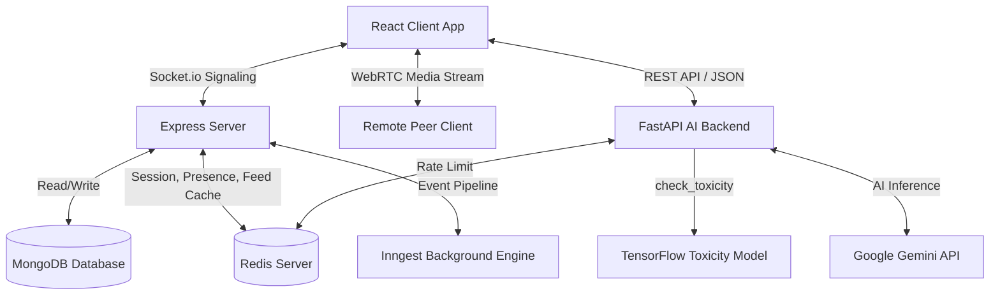

# PingUp 🚀
[](https://react.dev/)
[](https://nodejs.org/)
[](https://expressjs.com/)
[](https://fastapi.tiangolo.com/)
[](https://www.tensorflow.org/)
[](https://www.mongodb.com/)
[](https://redis.io/)
[](https://socket.io/)
[](https://clerk.com/)

PingUp is a premium, next-generation real-time social communication and collaboration platform. It combines WebRTC peer-to-peer voice calls, collaborative whiteboard drawing workspaces, live chat messaging, media sharing, and intelligent AI services featuring comment toxicity check filters and conversational LLM integrations.

---

## 🏗️ System Architecture



The system operates across three primary service boundaries:
1. **React.js Frontend (Vite + Tailwind)**: Integrates SSO Authentication via Clerk, manages state through Redux Toolkit, opens duplex socket connections for chat signaling and whiteboard synchronization, and establishes P2P media connections via WebRTC.
2. **Node.js/Express Server (Signaling & Core API)**: Handles database persistence through Mongoose/MongoDB, authenticates routes using Clerk JWT verification, maintains real-time sessions and caches in Redis, coordinates Socket.io rooms, and delegates background tasks to the Inngest runner.
3. **Python FastAPI Backend (AI Services)**: Powers Google Gemini 2.5 LLM chat/image endpoints, hosts a local TensorFlow machine learning model for comment moderation, and utilizes atomic Redis Lua rate-limiting scripts.

---

## 📂 Project Directory Structure & Code Layout

```text
pingup
│
├── client/                     # Vite React Frontend
│   ├── public/                 # Static assets, sound notification files
│   ├── src/
│   │   ├── api/                # Network interfaces
│   │   │   ├── axios.js        # Configured Axios instance with baseURL
│   │   │   ├── socket.js       # Socket.io connection manager (JWT authentication wrapper)
│   │   │   └── utils-getToken.js
│   │   ├── app/
│   │   │   └── store.js        # Redux Toolkit global store configuration
│   │   ├── calling/            # WebRTC Call & Whiteboard
│   │   │   ├── Roompage.jsx    # Audio stream connection controls and PiP UI
│   │   │   └── Whiteboard.jsx  # Interactive canvas & coordinate normalization
│   │   ├── components/         # Reusable presentation and interaction widgets
│   │   │   ├── CallNotification.jsx # Incoming call ring banner
│   │   │   ├── Notification.jsx     # Floating new-message toast
│   │   │   ├── PingBuddyModal.jsx   # Contextual chat-box AI copilot
│   │   │   ├── PostCard.jsx         # Feed post component containing AI explain/toxicity logic
│   │   │   ├── StoriesBar.jsx       # Horizontal user story feed
│   │   │   ├── StoryModal.jsx       # Interactive story creation dialog
│   │   │   ├── StoryViewer.jsx      # Slide-based story reader
│   │   │   └── UserCard.jsx
│   │   ├── features/           # Redux Slices
│   │   │   ├── connections/    # Follower/Following/Pending connection states
│   │   │   ├── messages/       # Chat history prepend/append state lists
│   │   │   └── user/           # Current authenticated user details and active calls
│   │   ├── Pages/              # Social and AI pages
│   │   │   ├── AIPage.jsx           # Voice/Text chat assistant powered by Gemini
│   │   │   ├── ChatBox.jsx          # Live messaging panel with inline AI helper
│   │   │   ├── Connections.jsx      # Connections lists (accept/decline incoming)
│   │   │   ├── CreatePost.jsx       # Post creation form
│   │   │   ├── Discover.jsx         # User directory search list
│   │   │   ├── Feed.jsx             # Activity stream with infinite scroll
│   │   │   ├── Layout.jsx           # Global sidebar navigation container
│   │   │   ├── Login.jsx            # Clerk sign-in boundary
│   │   │   ├── PhotoMagicPage.jsx   # Multi-modal image descriptor (captions, quotes, hashtags)
│   │   │   └── Profile.jsx          # Profile dashboard with cover/profile photo updates
│   │   ├── App.jsx             # Core router and socket listener manager
│   │   ├── index.css           # Utility classes and theme styling definitions
│   │   └── main.jsx            # React root bootstrap entrypoint
│   │
│   ├── eslint.config.js        # Linter rules
│   ├── index.html              # HTML shell template
│   ├── package.json            # Client dependency manifest
│   └── vite.config.js          # Vite build config
│
├── server/                     # Express.js Backend
│   ├── configs/
│   │   ├── db.js               # MongoDB connection client
│   │   ├── imageKit.js         # ImageKit cloud media upload config
│   │   ├── multer.js           # Multi-part form data parser middleware
│   │   ├── nodeMailer.js       # Nodemailer transporter and mail templates
│   │   └── redis.js            # Redis caching and RedisSubscriber client initialization
│   ├── controllers/
│   │   ├── messageController.js # Direct messaging and call history endpoints
│   │   ├── postController.js    # Post, Comment, Like, and Feed query handlers
│   │   ├── storyController.js   # Story uploads and views tracker
│   │   └── userController.js    # Connections, profiles, and search operations
│   ├── inngest/
│   │   └── index.js            # Inngest client and cron / event queue definitions
│   ├── middlewares/
│   │   └── auth.js             # Clerk JWT verification wrapper middleware
│   ├── models/
│   │   ├── Comment.js          # Post comments schema
│   │   ├── Connections.js      # P2P connection pending/accepted status schema
│   │   ├── Message.js          # Direct messages (media + text) schema
│   │   ├── Post.js             # User posts schema
│   │   ├── Story.js            # Multi-media stories (24-hour self-destruct) schema
│   │   └── User.js             # Profile settings, bio, theme, and privacy schema
│   ├── utils/
│   │   └── redisStore.js       # Atomic rate limiters, session tracking, typing indicators, and feed cache helpers
│   │
│   ├── Dockerfile              # Container specifications
│   ├── package.json            # Node server dependencies
│   ├── server.js               # Express application configurations and route attachments
│   ├── socketManager.js        # Socket.io adapters, presence broadcast, and WebRTC signaling
│   └── vercel.json             # Deployment settings
│
└── ai_backend/                 # Python FastAPI AI Service
    ├── services/
    │   ├── ml_service.py       # Toxicity local prediction handler
    │   ├── Toxicity_Comment_Detector.keras # Pre-trained Keras model
    │   └── vocab.txt           # 100k-word vocabulary configuration
    │
    ├── main.py                 # REST controllers, Gemini client, and sliding-window rate limiters
    ├── requirements.txt        # Python dependency manifest
    └── venv/                   # Local virtual environment
```

---

## ⚡ Core Functionalities & Technical Deep-Dives

### 1. Real-Time Voice Calls (WebRTC P2P)
Voice calling uses peer-to-peer communication using `RTCPeerConnection` for audio media sharing.

```text
Sender                                 Signaling Server (Socket.io)                       Receiver
  |                                                 |                                        |
  |--- 1. Emit "call:invite" ---------------------->|                                        |
  |                                                 |--- 2. Forward "call:incoming" -------->|
  |                                                 |                                        | (Accepts Call)
  |                                                 |<-- 3. Join Socket Room ----------------|
  |<-- 4. Receive "call:user-joined" ---------------|                                        |
  |                                                 |                                        |
  |=== 5. ESTABLISH PEER CONNECTION AND GATHER ICE CANDIDATES ===============================|
  |                                                 |                                        |
  |--- 6. SDP Offer ------------------------------->|                                        |
  |                                                 |--- 7. SDP Offer ---------------------->|
  |                                                 |<-- 8. SDP Answer ----------------------|
  |<-- 9. SDP Answer -------------------------------|                                        |
  |                                                 |                                        |
  |<========================= 10. Direct WebRTC Media Stream ===============================>|
```

- **NAT Traversal**: Configured with Google's public STUN servers (`stun:stun.l.google.com:19302`) to resolve ICE candidates across varying firewall topologies.
- **Ringing State Machine**: A 24-second timer is established upon an incoming invite. If no response occurs, the call is automatically declined. Background audio plays during the ringing phase.

### 2. Renegotiation & Screen Sharing (Glare Resolution)
Transitioning from audio-only to screen share streaming dynamically appends a video track to the active connection. To avoid SDP collisions (glare):
1. The initiating client captures screen tracks using `navigator.mediaDevices.getDisplayMedia`.
2. A state lock `isLocalTrackChangeRef` is set to `true` to signal that the renegotiation is client-initiated.
3. The peer connection's `onnegotiationneeded` event catches the state update, creates an offer, sets the local description, and transmits it via the socket room.
4. When renegotiation completes, the lock is released to avoid loop offers.

```javascript
pc.onnegotiationneeded = async () => {
  if (!isLocalTrackChangeRef.current) return; // Ignore updates from remote renegotiations
  if (isNegotiatingRef.current) return;       // Avoid concurrent offers
  
  try {
    isNegotiatingRef.current = true;
    const offer = await pc.createOffer();
    await pc.setLocalDescription(offer);
    socket.emit("call:signal", { roomId, signal: { type: "offer", sdp: offer } });
  } catch (err) {
    console.error("Negotiation error:", err);
  } finally {
    isNegotiatingRef.current = false;
    isLocalTrackChangeRef.current = false;
  }
};
```

### 3. Picture-in-Picture (PiP) Calling Widget
When navigating away from the active call room page, the frontend intercepts router changes and toggles the Redux state `isMinimized = true`. The video and voice feeds are rendered inside a floating, draggable card overlay containing:
- Live call durations.
- Mute/Unmute microphone toggles.
- Speakerphone gain modifiers.
- Immediate call teardown handles.

This allows users to browse their social feeds, check settings, or write messages while maintaining their active voice/screen call.

### 4. Collaborative Whiteboard Coordinate Mapping
Drawing on HTML5 canvases styled dynamically (e.g. `w-full h-full`) can cause cursor deviations if DOM bounds resize differently from coordinate vectors. To support pixel-perfect synchronizations between varying monitor configurations:
- Coordinates are normalized to a standard `[0,1]` range before transmitting to the socket:
  $$\text{Normalized } X = \frac{\text{Cursor } X}{\text{Canvas Element Width}}$$
  $$\text{Normalized } Y = \frac{\text{Cursor } Y}{\text{Canvas Element Height}}$$

- Upon receiving drawing packets, the remote client maps the coordinates to their local dimensions:
  $$\text{Local Draw } X = \text{Normalized } X \times \text{Local Canvas Element Width}$$
  $$\text{Local Draw } Y = \text{Normalized } Y \times \text{Local Canvas Element Height}$$

### 5. Conversational AI Assistant & Speech-to-Text
The chatbot uses a Gemini-powered endpoint with advanced transcription tools:
- **Speech-to-Text Transcription**: Integrates Microsoft Azure Cognitive Services Speech SDK and the web browser's standard Web Speech API to provide real-time voice inputs.
- **Greeting Cache**: Simple phrases (e.g. "hello", "thanks") bypass the LLM entirely, returning predefined answers instantly.
- **State Preservation**: The chat context is maintained during active sessions, feeding the conversation history directly into the LLM context.

### 6. Photo Magic (Multi-Modal Image Generation)
Using Gemini’s multi-modal capabilities, users can upload images to generate:
- Engaging inspirational quotes related to the image.
- Catchy social media captions complete with emojis.
- Trending and highly relevant hashtags.

### 7. AI slang Decoder (AI Explain)
Using the `/api/explain` endpoint, users can decode slang, memes, idioms, or technical jargon in posts or comments. The backend analyzes the context and returns a simple summary in standard English or a specific target language (e.g., Spanish, French) requested by the user.

### 8. Text Classification Toxicity Comment Guard
To maintain a safe community, comment submissions are intercepted by a local machine learning model before database write:
- **Architecture**: A TensorFlow Keras model (`Toxicity_Comment_Detector.keras`) is loaded on startup in Python.
- **Processing**: Inputs are mapped via a `TextVectorization` layer using a 100k vocabulary token file (`vocab.txt`) across sequence limits of 200 elements.
- **Evaluation**: Predictions exceeding a `0.4` threshold trigger a block response, causing the frontend to display a validation error.

```python
# Keras model classification logic inside ml_service.py
def check_toxicity(comment: str):
    vectorized_comment = vectorizer([comment])
    prediction = model.predict(vectorized_comment)[0]
    return bool(prediction[0] > 0.4)
```

### 9. Atomic Rate Limiter (Redis Lua Scripts)
To prevent API abuse, endpoints are protected by a rolling sliding-window rate limiter using Redis Sorted Sets (`zset`) with Lua scripts to ensure atomicity.
- **Mechanism**: The system records timestamps of requests using a moving cutoff window ($now - windowMs$).
- **Lua Script**:
  ```lua
  local now = tonumber(ARGV[1])
  local window_ms = tonumber(ARGV[2])
  local member = ARGV[3]
  local cutoff = now - window_ms

  redis.call('zadd', KEYS[1], now, member)
  redis.call('zremrangebyscore', KEYS[1], '-inf', cutoff)

  local current = redis.call('zcard', KEYS[1])
  local oldest = redis.call('zrange', KEYS[1], 0, 0, 'WITHSCORES')
  local ttl = 0

  if #oldest > 0 then
    local oldest_score = tonumber(oldest[2])
    ttl = math.max(0, math.ceil((oldest_score + window_ms - now) / 1000))
  end

  redis.call('expire', KEYS[1], tonumber(ARGV[4]))
  return { current, ttl }
  ```

### 10. Presence & Multi-Device Session Tracking (Redis Store)
Redis acts as a high-performance memory store for real-time operations:
- **Multi-Device Presence**: When a user opens multiple browser tabs, their connections are stored in a hash map under `online:socket:${userId}` with timestamps. The user is marked offline only when all associated socket IDs are removed.
- **Typing Indicators**: Typing indicators are cached in Redis (`typing:${conversationKey}`) with an 8-second expiration to prevent stale indicators if a user disconnects abruptly.
- **Feed Cache & Invalidation**: Feeds are cached in Redis to minimize database lookups. When a user creates a post, the cache is invalidated for the user, their followers, and their connections:
  ```javascript
  const user = await User.findById(userId);
  const impactedUsers = [...new Set([userId, ...user.connections, ...user.following])];
  await Promise.all(impactedUsers.map((id) => deleteFeedCacheForUser(id)));
  ```

### 11. Inngest Background Workflows
The application uses Inngest to manage event-driven background jobs:
- **User Sync**: Syncs user creation, updates, and deletions from Clerk webhooks to the MongoDB database.
- **Connection Reminders**: Sends email invitations. If a connection remains pending after 24 hours, the engine automatically triggers a follow-up reminder.
- **Story Cleanup**: Automatically removes stories exactly 24 hours after publication.
- **Daily Message Summaries**: A daily cron job (`0 9 * * *`) scans for unseen messages and emails users a summary of their unread notifications.

---

## 🗄️ Database Schemas

### User Schema (`User.js`)
```javascript
{
  _id: { type: String, required: true },              // Matches Clerk User ID
  email: { type: String, required: true, unique: true },
  username: { type: String, required: true, unique: true },
  full_name: { type: String, required: true },
  profile_picture: { type: String, default: "" },
  cover_photo: { type: String, default: "" },
  bio: { type: String, default: "" },
  location: { type: String, default: "" },
  connections: [{ type: String, ref: 'User' }],       // Interconnected friends
  followers: [{ type: String, ref: 'User' }],
  following: [{ type: String, ref: 'User' }],
  theme: { type: String, enum: ['light', 'dark'], default: 'light' },
  privateFollowers: { type: Boolean, default: false }, // Protects follower list visibility
  lastSeen: { type: String, default: null }
}
```

### Post Schema (`Post.js`)
```javascript
{
  user: { type: String, ref: 'User', required: true },
  content: { type: String, default: "" },
  image_urls: [{ type: String }],
  likes_count: [{ type: String, ref: 'User' }],
  total_comments: { type: Number, default: 0 },
  post_type: { type: String, enum: ['public', 'connections'], default: 'public' }
}
```

### Comment Schema (`Comment.js`)
```javascript
{
  post_id: { type: mongoose.Schema.Types.ObjectId, ref: 'Post', required: true },
  user: { type: String, ref: 'User', required: true },
  content: { type: String, required: true },
  likes: [{ type: String, ref: 'User' }],
  dislikes: [{ type: String, ref: 'User' }]
}
```

### Message Schema (`Message.js`)
```javascript
{
  from_user_id: { type: String, ref: 'User', required: true },
  to_user_id: { type: String, ref: 'User', required: true },
  text: { type: String, default: "" },
  message_type: { type: String, enum: ['text', 'image'], default: 'text' },
  media_url: { type: String, default: "" },
  seen: { type: Boolean, default: false }
}
```

### Story Schema (`Story.js`)
```javascript
{
  user: { type: String, ref: 'User', required: true },
  stories: [
    {
      content: { type: String },
      media_url: { type: String },
      media_type: { type: String, enum: ['text', 'image', 'video'] },
      background_color: { type: String, default: '#000000' },
      createdAt: { type: Date, default: Date.now },
      view_count: [{ type: String, ref: 'User' }] // Users who opened this story
    }
  ]
}
```

---

## 🔌 API Reference & Endpoints

### Express.js API Endpoints

#### Users & Connections (`/api/user`)
- `GET /data`: Returns profile info for the authenticated user.
- `POST /update`: Updates profile properties (supports multipart uploads for avatars/covers).
- `POST /discover`: Fuzzy searches users by username, email, full name, or location.
- `POST /follow`: Follows a user.
- `POST /unfollow`: Unfollows a user.
- `POST /connect`: Sends a connection request (limits: 20 per 24 hours).
- `POST /accept`: Accepts a pending connection request.
- `POST /reject`: Rejects a pending connection request.
- `POST /remove-connection`: Removes an established connection.
- `GET /connections`: Returns list of followers, following, and active connections.
- `GET /presence/:id`: Returns the online/offline status and last seen timestamp of a user.
- `POST /profiles`: Returns profile info and post history for a specific user ID.

#### Feed Posts & Comments (`/api/post`)
- `POST /add`: Creates a new post (supports up to 4 images).
- `GET /feed`: Returns the social feed (uses Redis caching, paginated with cursor query parameters).
- `POST /like`: Likes or unlikes a post.
- `POST /comment`: Adds a comment (checks toxicity and applies rate limits).
- `GET /:postId/comments`: Returns comments for a post, sorted by latest first.
- `POST /comment/like`: Likes a comment.
- `POST /comment/dislike`: Dislikes a comment.
- `POST /comment/delete`: Deletes a comment.
- `POST /delete`: Deletes a post.
- `POST /edit`: Modifies post content.

#### Stories (`/api/story`)
- `POST /create`: Publishes a new story (supports background colors, image, text, or video).
- `GET /get`: Returns stories from connections and followed users, sorted by latest story date.
- `POST /view/:storyId`: Marks a story item as read by the user.
- `DELETE /:storyId`: Manually deletes a story.

#### Messages (`/api/message`)
- `POST /send`: Sends a chat message (supports text and image attachments).
- `POST /get`: Returns chat history between two users (paginated).
- `POST /delete`: Deletes a message.
- `GET /recent-messages`: Returns list of recent conversations.

---

### FastAPI AI Backend Endpoints

- `POST /api/chat`: Evaluates conversational prompts with Gemini 2.5. Filters standard greeting formats.
- `POST /api/photo-magic`: Multi-modal endpoint that generates hashtags, captions, or quotes from uploaded images.
- `POST /api/check-toxicity`: Uses the local TensorFlow model to return a toxicity boolean.
- `POST /api/explain`: Evaluates post or comment contents and explains slang or technical jargon in the requested language.

---

## 🛠️ Local Installation & Setup

### Prerequisites
- **Node.js** (v18+)
- **Python** (v3.9+)
- **MongoDB** (Local instance or Atlas cloud connection)
- **Redis** (Local instance or cloud connection)

---

### Step-by-Step Setup

#### 1. Clone the repository
```bash
git clone https://github.com/AvinashGottapu/pingup.git
cd pingup
```

#### 2. Configure Environment Variables (`.env`)

##### Express Backend (`server/.env`)
```env
PORT=5000
MONGODB_URI=mongodb://localhost:27017/pingup
CLERK_SECRET_KEY=sk_test_...
CLERK_PUBLISHABLE_KEY=pk_test_...
IMAGEKIT_PUBLIC_KEY=public_...
IMAGEKIT_PRIVATE_KEY=private_...
IMAGEKIT_URL_ENDPOINT=https://ik.imagekit.io/...
REDIS_URL=redis://12705.1.1.1:6379 # Or your redis cloud link
FRONTEND_URL=http://localhost:5173
EMAIL_HOST=smtp.gmail.com
EMAIL_PORT=587
EMAIL_USER=your_email@gmail.com
EMAIL_PASS=your_email_password
```

##### React Client (`client/.env`)
```env
VITE_CLERK_PUBLISHABLE_KEY=pk_test_...
VITE_BASEURL=http://localhost:5000
VITE_AI_API_URL=http://localhost:8000
VITE_AZURE_SPEECH_KEY=your_azure_speech_key_optional
VITE_AZURE_REGION=your_azure_region_optional
```

##### AI Backend (`ai_backend/.env`)
```env
GEMINI_API_KEY=AIzaSy...
REDIS_URL=redis://localhost:6379
```

---

#### 3. Run the Services

##### Start Express Backend
```bash
cd server
npm install
npm run dev
```

##### Start React Frontend
```bash
cd client
npm install
npm run dev
```

##### Start FastAPI AI Service

###### Windows
```cmd
cd ai_backend
python -m venv venv
venv\Scripts\activate
pip install -r requirements.txt
uvicorn main:app --reload --port 8000
```

###### macOS / Linux
```bash
cd ai_backend
python3 -m venv venv
source venv/bin/activate
pip install -r requirements.txt
uvicorn main:app --reload --port 8000
```

---

## 👩‍💻 Contributors
- **Avinash Gottapu** - *Lead Full Stack Developer* - [GitHub](https://github.com/AvinashGottapu)
